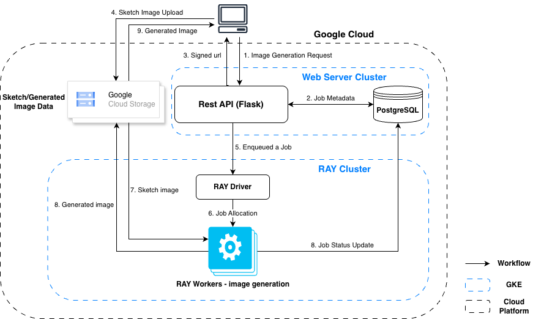

# SketchGallery

Asynchronous Scalable Sketch-to-Image Generation Service

## Title and Participants

- Title: Sketch-to-Gallery(A Scalable Sketch-to-Image Generation Service)
- Participants: Sungboo Park and Dukhwan Kim

## Project Goals

- The goal of this project is to build a scalable web service that transforms simple sketches into high-quality rendered images. Through a REST API, users can upload rough sketches representing their initial ideas, and the system processes them with a generative model to create visual outputs.
- The architecture separates user interaction, processing, and storage into independent components, making the system scalable, modular, and well-suited for background workloads. Generated results are stored in a persistent gallery where users can later retrieve, browse, and manage their creations.
- More importantly, this service is designed around the idea of effortless creativity. A user only needs to provide a rough sketch, and the system can continue working in the background while the user is away, refining the input into an image that feels expressive, complete, and worthy of being displayed in a gallery.
- By lowering the barrier from imagination to creation, the project enables anyone to turn simple visual ideas into a growing personal collection of artwork. Ultimately, this project demonstrates how cloud-based service architecture can power scalable and modular AI-driven creative experiences.

## Software and Hardware Components

- Software Components
  1. Ingress / Load Balancer: Routes external traffic to the REST API
  2. REST API + UI (Flask): Handles metadata, signed URL issuance, job status, and gallery views
  3. Metadata Database (PostgreSQL): Stores users, job status, and gallery metadata
  4. Worker Service (planned): Processes sketches using a generative model and writes results back to storage
  5. Google Cloud Storage (Object Storage): Stores input sketches and generated images
  6. Monitoring & Logging Stack: Collects logs, metrics, and health signals for reliability

- Hardware / Cloud Infrastructure
  1. Google Cloud Platform (GCP)
  2. Google Kubernetes Engine (GKE)
  3. Compute Engine Node Pools for API and worker workloads

## Architecture Diagram



## Current Runtime Architecture

This repository currently runs with a web control plane and object-storage data path:

1. Webserver (`src/webserver`): Flask UI + API + Postgres metadata orchestration
2. Metadata DB (`src/postgres`): PostgreSQL on Kubernetes
3. Storage Data Path (GCS): browser uploads/downloads image objects directly using signed URLs

### Endpoints

- `GET /health`
- `POST /api/v1/uploads/sign` (issue signed upload URL for PNG)
- `POST /api/v1/jobs` (JSON: `sketch_key`, `title`, `prompt`, `style`)
- `GET /api/v1/jobs/<job_id>`
- `GET /api/v1/jobs/<job_id>/result`
- `GET /api/v1/gallery`

### Quick Start

```bash
cd SketchGallery
python3 -m venv .venv
source .venv/bin/activate
pip install -r requirements.txt
```

## Deployment (Kubernetes)

This repository deploys in two parts:

- Web stack: Postgres + Webserver (`scripts/k8s-stack.sh`)
- Ray gateway stack: Ray API service (`scripts/ray-stack.sh`)

### 1) Prepare environment

```bash
cd SketchGallery
cp .env.example .env
```

Fill at least:

- `GCS_BUCKET`
- `RAY_SHARED_TOKEN`
- `RAY_GENERATION_URL`
- `WEB_PUBLIC_BASE_URL` (required if Ray callback should use public URL)
- `RAY_ADDRESS` (must start with `ray://` for external Ray cluster mode)

Optional but recommended:

- `HF_TOKEN` (for `mode=ai`)
- `NAMESPACE` (default: `default`)

### 2) Build container images

For Minikube/local cluster, build inside Minikube Docker daemon:

```bash
eval "$(minikube docker-env)"
docker build -f src/postgres/Dockerfile -t sketchgallery-postgres:16 src/postgres
docker build -f src/webserver/Dockerfile -t sketchgallery-web:latest .
docker build -f src/raycluster/Dockerfile -t sketchgallery-ray:latest .
```

For GKE/remote cluster:

- Push images to Artifact Registry
- Update image names in Kubernetes manifests (or `kubectl set image`) before deploy

### 3) Create secrets (if needed)

Postgres secret is auto-applied by `k8s-stack.sh` if missing (example secret with default value).
For non-local use, create your own strong secret:

```bash
kubectl -n "${NAMESPACE:-default}" create secret generic postgres-secret \
  --from-literal=POSTGRES_DB=sketchgallery \
  --from-literal=POSTGRES_USER=sketchgallery \
  --from-literal=POSTGRES_PASSWORD='REPLACE_WITH_STRONG_PASSWORD' \
  --dry-run=client -o yaml | kubectl apply -f -
```

If you use a JSON service account key file, create:

```bash
kubectl -n "${NAMESPACE:-default}" create secret generic gcp-sa-key \
  --from-file=key.json=/absolute/path/to/key.json \
  --dry-run=client -o yaml | kubectl apply -f -
```

### 4) Deploy

```bash
./scripts/k8s-stack.sh up
./scripts/ray-stack.sh up
```

Check status:

```bash
./scripts/k8s-stack.sh status
./scripts/ray-stack.sh status
```

### 5) Access the web app

Local port-forward:

```bash
kubectl -n "${NAMESPACE:-default}" port-forward svc/sketchgallery-web 5050:5050
```

Then open: `http://127.0.0.1:5050`

### 6) Logs and troubleshooting

```bash
./scripts/k8s-stack.sh logs-web
./scripts/ray-stack.sh logs
kubectl -n "${NAMESPACE:-default}" get events --sort-by=.metadata.creationTimestamp | tail -n 50
```

### 7) Teardown

```bash
./scripts/ray-stack.sh down
./scripts/k8s-stack.sh down
```

### Unified Webserver (Flask UI + API on Postgres)

The production-oriented webserver is implemented at `src/webserver/app.py`.

It serves:

- UI routes: `/`, `/create`, `/jobs/<id>`, `/gallery`
- API routes: `/api/v1/uploads/sign`, `/api/v1/jobs`, `/api/v1/jobs/<id>`, `/api/v1/gallery`

Run (with Postgres + GCS env):

```bash
cd SketchGallery
pip install -r requirements.txt
export PGHOST=127.0.0.1
export PGPORT=5432
export PGDATABASE=sketchgallery
export PGUSER=sketchgallery
export PGPASSWORD=sketchgallery
export GCS_BUCKET=your-bucket-name
export GCS_UPLOAD_URL_EXPIRE_SEC=600
export GCS_DOWNLOAD_URL_EXPIRE_SEC=600
python3 src/webserver/app.py
```

Kubernetes manifests:

- Postgres: `src/postgres/postgres-k8s.yaml`
- Webserver: `src/webserver/webserver-k8s.yaml`

## Interaction Between Components

1. Browser requests a signed upload URL from `POST /api/v1/uploads/sign`.
2. Browser uploads PNG directly to GCS with signed `PUT` URL.
3. Browser submits metadata + `sketch_key` to webserver (`/create` or `POST /api/v1/jobs`).
4. Webserver creates job ID and stores metadata in Postgres.
5. Current placeholder flow copies sketch object to `results/<job_id>.png` in GCS.
6. Gallery/detail pages render signed download URLs generated by webserver.

This design keeps large file transfer out of the webserver request body path.

## Debugging and Testing Strategy

- We use:
  1. `kubectl logs` for Postgres/Webserver pods
  2. Port-forwarding for local browser/API verification
  3. Postgres query checks for metadata state validation
- Testing approach:
  1. UI smoke test (create/gallery/job detail)
  2. API integration (signed upload URL -> direct GCS upload -> job create -> gallery fetch)
  3. Kubernetes readiness/liveness verification

### Capacity test (copy mode + delay simulation)

Use the load test script to estimate how many concurrent users are sustainable in current setup.

```bash
cd SketchGallery
export TEST_COPY_DELAY_SEC=15
python3 scripts/load_test_web_capacity.py \
  --base-url http://127.0.0.1:5050 \
  --sketch-key sketches/sample.png \
  --mode test \
  --total 40 \
  --concurrency 10
```

The script submits concurrent `POST /api/v1/jobs`, polls job status, and prints:

- submit latency (`avg`, `p50`, `p95`)
- completed job latency (`avg`, `p50`, `p95`)
- completed throughput (`jobs/sec`)
